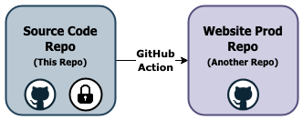

# Sample Website with GitOps
## About
Sample website created using:
- [npm](https://www.npmjs.com/) for package management
- [gulp](https://gulpjs.com/) for html includes and live reload and build/debug scripts
- [GitHub actions](https://docs.github.com/en/actions) to publish the site
- [uikit](https://getuikit.com/) for responsive UI components

Meant to be used as an example for creating a website that has a continuous build and deployment pipeline setup using GitOps with GitHub Actions.

All tools used to create and host the sample website are completely free.

## Running the site for debugging
Run the following in a terminal in the root directory of the repo
  ```console
  npm i 
  npm start
  ```

`npm i` installs all the dependencies to build the website

`npm start` does the following
- Builds the site into the `dist` folder using gulp scripts ([gulpfile.js](gulpfile.js))
- Serves the website on `localhost:3000`
- Opens a browser on `localhose:3000`
- Enables livereload so any changes in the `src` folder are automatically built and the website is refreshed

## Build and deployment pipeline
Here is how the build/deployment pipeline is set up:



This repo is intended to be the source code repo and is meant to be a private repo. 
The [website's prod repo](https://github.com/mupuri/sample-website-prod) is a public repo and is hosted using GitHub Pages. This split in repos was made because we would ideally want our source code to live in a private repo and GitHub Pages is not free in private repos. Additionally, it is nice to have a clean separation between dev code and production artifacts.

The [GitHub action](.github/workflows/publish.yml) in this repo does the following any time code is merged into the master branch of this repo:
- Installs all package dependencies by running `npm ci`
- Builds the website using npm to run gulp build scripts by running `npm publish` which in turn runs the publish gulp script
- Uploads the dist folder generated by running the publish script into the Website's prod repo


## Hosting
The sample website is hosted for free using GitHub Pages: https://mupuri.github.io/sample-website-prod/

GitHub pages was chosen to host the sample website because it is completely free, provides HTTPS, does not have any hard bandwidth limits and allows hosting sites that are up to 1GB.

Currently, the website does not have a custom domain. However, with GitHub pages, it is super easy to [set up a custom domain](https://docs.github.com/en/github/working-with-github-pages/managing-a-custom-domain-for-your-github-pages-site) if required.